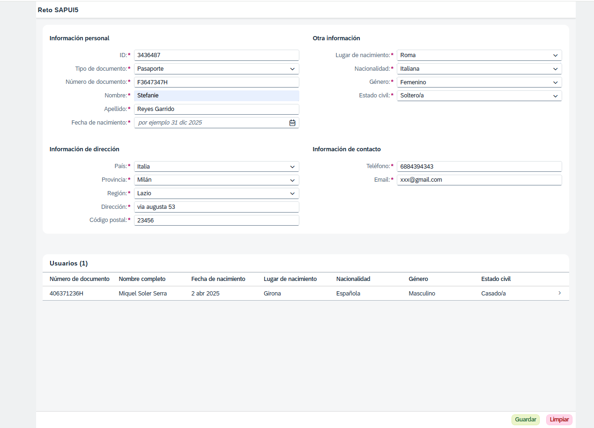
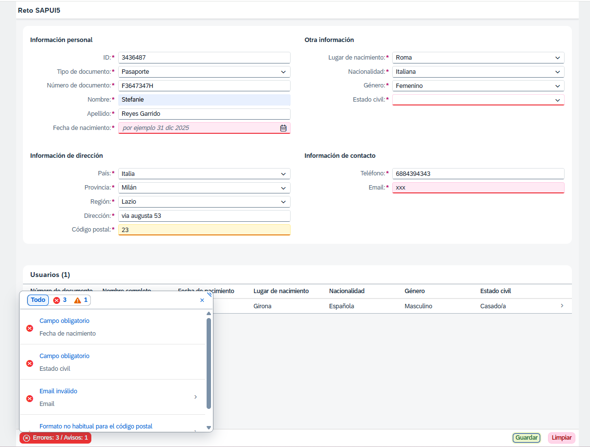
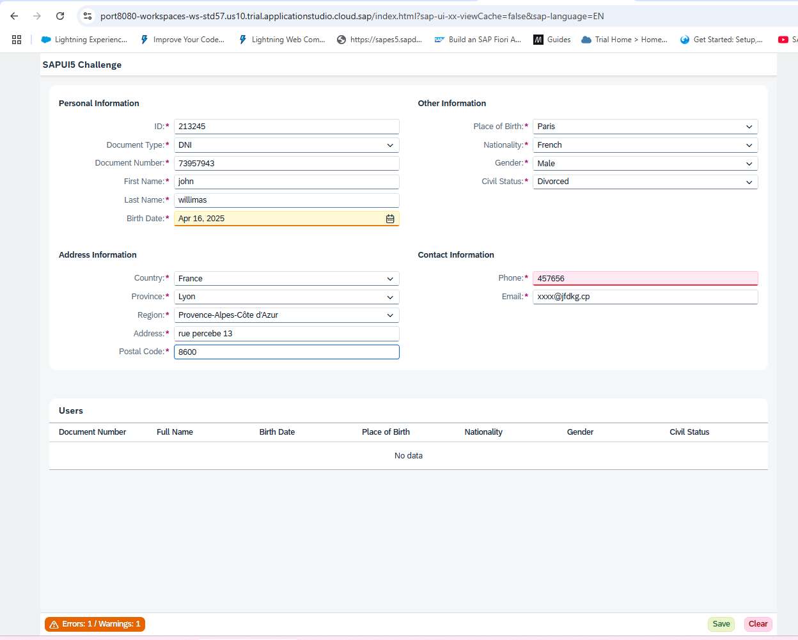
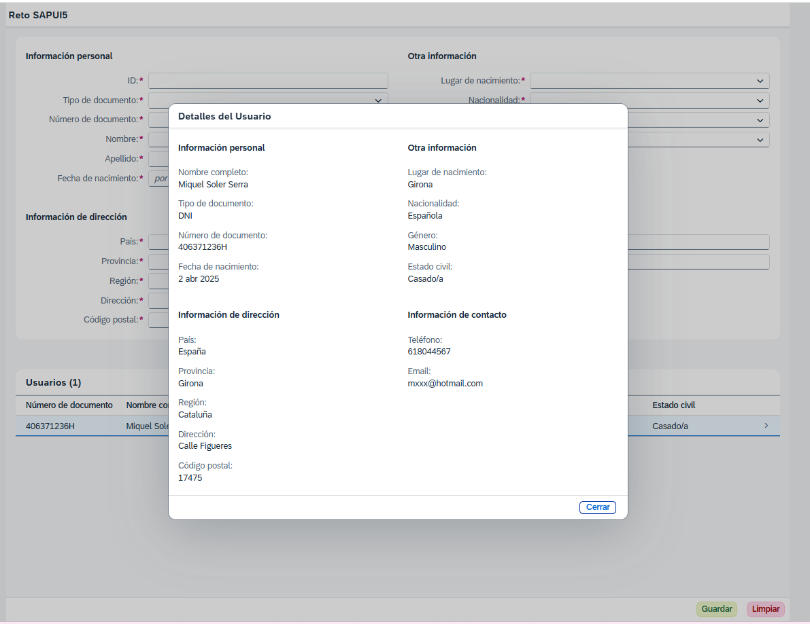
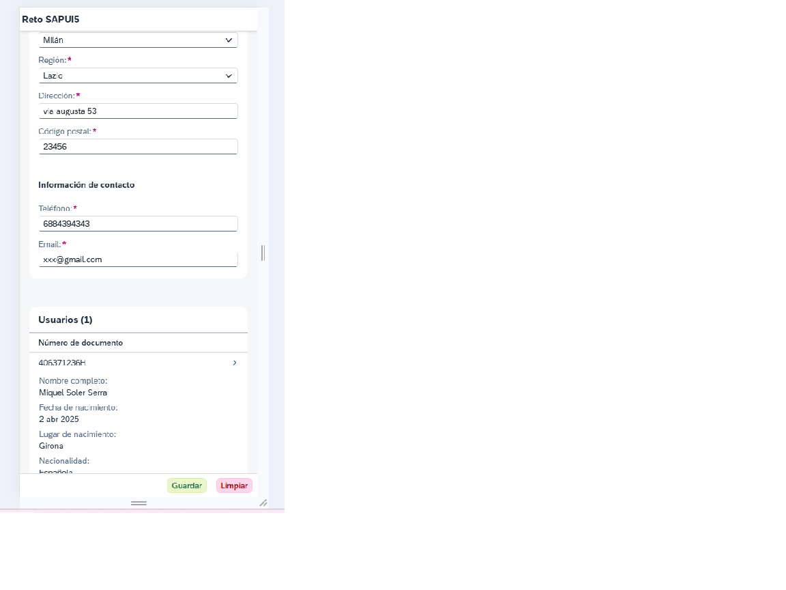

# SAPUI5 Challenge – User Form Application

This project is a submission for the SAPUI5 Beginners Challenge. It is a full SAPUI5 application built using XML Views and JSON Models. The application features a user input form with validation, message handling, table listing and detail dialogs – fully responsive and multilingual.

---

## Features

✅ Responsive user form with:
- Input validation (required fields, pattern checks)
- Real-time and on-submit validation
- Date picker with future date restriction and age warnings

✅ Dynamic select inputs using domain values:
- Gender, Document Type, Civil Status, etc.
- Values translated dynamically using i18n

✅ Smart message handling:
- Errors and warnings shown in MessagePopover
- Smart scroll-to-field on message click
- Message button dynamically updates icon, color and text

✅ User list with:
- Table showing saved users with translation in columns
- Detail dialog with grouped fields and full data

✅ Toolbar with:
- Clear form
- Save new user
- Validation summary button (MessagePopover)

✅ Fully translated to English and Spanish (i18n)

✅ Locale-aware date formatting using standard SAPUI5 formatting

---

##  Technologies

- SAPUI5 / OpenUI5
- XML Views + JS Controller
- JSON Models
- i18n for multilingual support
- MessageManager & MessagePopover
- CSS customizations (header, spacing)

---

##  Screenshots

###  Vista principal con datos guardados

---

###  Validación del formulario con MessagePopover

---

###  Multilenguaje (ejemplo en inglés)

---

###  Vista de detalle del usuario

---

###  Versión responsive en móvil

---

##  How to Run

1. Clone the repository
2. Run on local Fiori tools or SAP Business Application Studio
3. Open the app via the `index.html` 

---

##  Notes

- Fully local solution using JSON models – no backend.
- Clean code with reusable formatters and domain translators.
- Designed to match the look & feel of the official challenge template.

---

